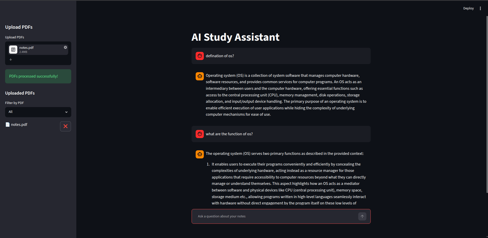

# AI Study Assistant

A local RAG-based AI Study Assistant built using:

* LangChain
* ChromaDB
* Ollama
* Streamlit
* HuggingFace Embeddings

## Features

* Multi-PDF upload support
* Semantic search using embeddings
* Local LLM responses using Ollama
* Persistent vector database
* Chat-style interface
* PDF filtering and management

## Tech Stack

* Python
* Streamlit
* LangChain
* ChromaDB
* Ollama
* Sentence Transformers

## Project Structure

```bash
ai-study-assistant/
│
├── assets/
├── utils/
├── app.py
├── README.md
├── requirements.txt
└── .gitignore
```

## Run Locally

```bash
git clone <your-repo-url>

cd ai-study-assistant

python3 -m venv venv

source venv/bin/activate

pip install -r requirements.txt

streamlit run app.py
```

## Screenshot



## Future Improvements

* Add source citations for answers
* Quiz generation from notes
* Flashcard generation
* Voice interaction
* Authentication system
* Cloud deployment
* Better retrieval optimization
* Support for DOCX and TXT files
